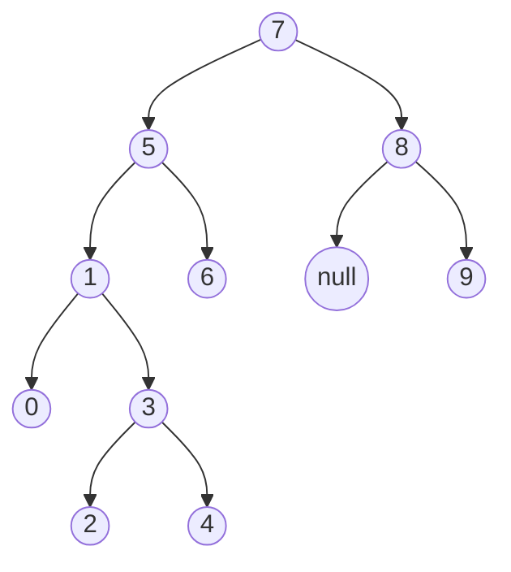

## Binnary search

```mermaid
graph  TD
A((7))  -->  B((5))
B  -->  C((1))
A  -->  D((8))
C  -->  G((0))
C  -->  E((3))
B  -->  F((6))
D  -->  K((null))
D  -->  H((9))
E  -->  J((2))
E  -->  I((4))
```

Big-O notation: **O(log n)**
